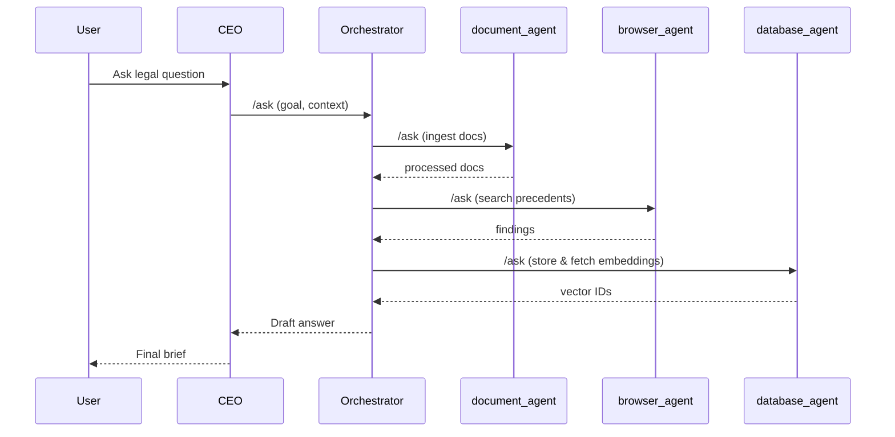

# System Architecture (Refactor v2)

## Layers

1.  **UI** – Gradio ↔ AG-UI backend (FastAPI).
2.  **CEO Agent** – Vorder-facing chatbot, no heavy lifting.
3.  **Orchestrator Agent** – Runs TaskGraph, publishes A2A `/ask|/tell|/stream`.
4.  **Specialized Manager Layer**
    *   Exports a **registry helper** that maps `CAPABILITY` tags to import paths.
    *   Discovers worker agents at start-up and attaches them to the Orchestrator graph.
5.  **Worker Agents** (`*_agent`)
    *   `document_agent` – intake pipeline.
    *   `browser_agent` – web/docket scraping.
    *   `database_agent` – pgvector queries + schema ops.
    *   `legal_manager_agent` – memo composer & citation verifier (phase-2).
6.  **Shared Services (MCP)**
    *   File store (Rust), ChromaDB, Postgres, Neo4j, OpenTelemetry.

## A2A Flow

_Only the CEO talks to the user; all back-channel chatter is A2A._
