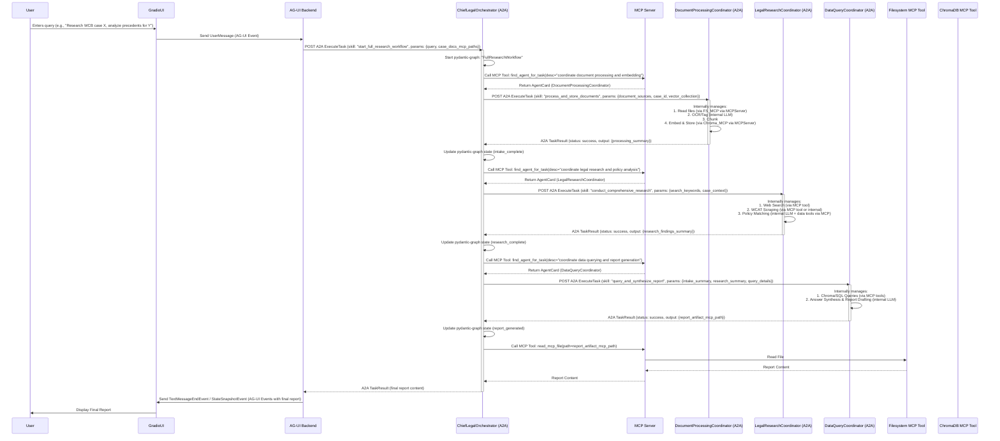
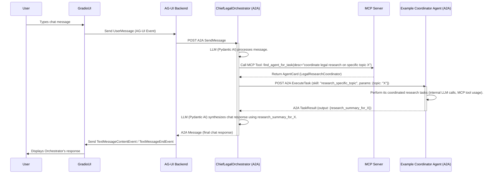

# savagelysubtle-airesearchagent - Key Workflows (Simplified Agents)

This document outlines interactions for key use cases with the simplified agent hierarchy.

## 1. User Initiates Full Legal Research Workflow



**Key Workflow Changes:**

*   The Orchestrator now delegates to higher-level Coordinator agents.
*   Each Coordinator agent encapsulates a larger part of the workflow (e.g., `DocumentProcessingCoordinator` handles the entire document intake pipeline).
*   The internal complexity of OCR, tagging, embedding, searching, etc., is managed *within* the respective Coordinator agent, which itself uses Pydantic AI and MCP tools.

## 2. Interactive Chat with Orchestrator

This workflow remains largely the same at a high level, as the user interacts with the Orchestrator. The difference is that if the Orchestrator decides to delegate a sub-task arising from the chat, it will discover and invoke a Coordinator agent rather than a more granular Guild Member.


The core message flow and protocol usage remain consistent, with the primary change being the granularity of agents invoked by the Orchestrator.
```