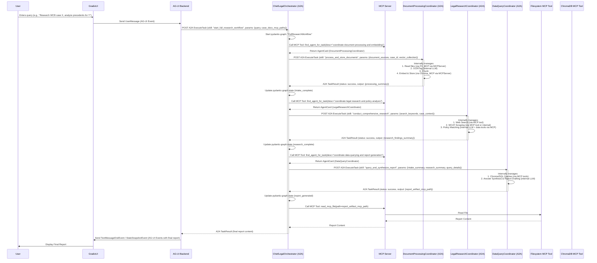
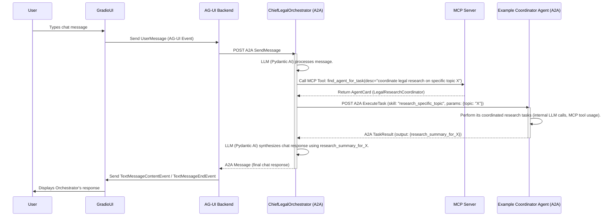

## README.md

```markdown
# savagelysubtle-airesearchagent - Architectural Design & Implementation Plan

## 1. Project Overview & Vision

**savagelysubtle-airesearchagent** is a sophisticated, distributed multi-agent system designed for advanced legal research. It leverages a microservice architecture to provide a modular, scalable, and maintainable platform for tasks including document ingestion, legal research, data analysis, and report generation.

The vision is to create a powerful AI assistant that can significantly augment legal professionals' capabilities by automating complex research workflows, providing insightful analysis, and ensuring data traceability and consistency. The system is built with a focus on modern AI frameworks, standardized communication protocols, and robust data management.

## 2. Core Architectural Pillars

The architecture is founded on the following key principles and technologies:

1.  **Core Agent Logic (Pydantic AI):** All specialized agents, including Coordinators and their task-specific sub-agents, are implemented using `pydantic_ai.Agent`, leveraging its capabilities for structured input/output, tool usage, and LLM interaction.
2.  **Orchestration (Pydantic AI + pydantic-graph):** The central **ChiefLegalOrchestrator** agent uses Pydantic AI for its LLM-driven decision-making and `pydantic-graph` to manage the complex, stateful "Task Graph" that defines the overall research workflows.
3.  **A2A Service Layer (FastA2A):** Each core agent (ChiefLegalOrchestrator, DocumentProcessingCoordinator, LegalResearchCoordinator, DataQueryCoordinator) is exposed as an independent, A2A-compliant HTTP microservice using FastA2A (or a similar ASGI A2A server implementation). This enables standardized inter-agent communication.
4.  **Service Discovery & Shared Resources (MCP):**
    *   A custom Python-based **MCP Server** (built with FastMCP) acts as a central registry for all A2A agent services. Agent capabilities are advertised via JSON "Agent Cards." The MCP Server provides a `find_agent_for_task` tool for dynamic agent discovery.
    *   It also exposes **Shared MCP Tools** that provide standardized access to persistent storage and other utilities:
        *   SQL Database access (e.g., via `mcpDataBases` or a custom wrapper).
        *   Vector Database access (e.g., via `autogen_rag_chroma` or a custom wrapper).
        *   Graph Database access (e.g., via a Neo4j MCP adapter, potentially for Task Graph persistence or knowledge graphs).
        *   Filesystem operations (via the user-provided Rust-based MCP filesystem server).
5.  **Frontend Interaction (AG-UI):** A dedicated **AG-UI Backend Service** (built with FastAPI and the AG-UI Python SDK) acts as a bridge between the Gradio Web UI and the ChiefLegalOrchestrator's A2A service. It handles UI events, manages conversation state, and translates interactions into A2A tasks.

## 3. Core Technologies Used

*   **Python:** Primary programming language.
*   **Pydantic AI:** For core agent logic and LLM interactions.
*   **pydantic-graph:** For orchestrating complex workflows within the ChiefLegalOrchestrator.
*   **FastA2A (or equivalent ASGI A2A lib):** For creating A2A-compliant microservices.
*   **FastMCP (or equivalent Python MCP lib):** For the custom MCP server.
*   **Model Context Protocol (MCP):** For service discovery and shared tool access.
*   **Agent-to-Agent (A2A) Protocol:** For inter-agent communication.
*   **Agent User Interaction Protocol (AG-UI):** For communication between the UI and the backend.
*   **FastAPI:** For the AG-UI Backend Service.
*   **Gradio:** For the Web User Interface.
*   **ChromaDB (via MCP tool):** For vector storage and retrieval.
*   **SQLite/PostgreSQL (via MCP tool):** For structured data storage.
*   **Neo4j (via MCP tool):** For graph data storage (e.g., knowledge graphs, Task Graph persistence).
*   **Rust-based MCP Filesystem Server:** For artifact storage and file operations.
*   **Docker & Docker Compose:** For containerization and service orchestration during development and deployment.
*   **Poetry / UV:** For dependency management.

## 4. Setup Instructions

### 4.1. Prerequisites

*   Python 3.10+
*   Poetry (or UV for `uv pip compile` and `uv sync`)
*   Docker & Docker Compose (for running databases and other external services)
*   Access to LLM APIs (OpenAI, Anthropic, Google Gemini, etc.) and corresponding API keys.
*   Rust toolchain (if building the MCP filesystem server from source).

### 4.2. Dependency Installation

1.  Clone the repository:
    ```bash
    git clone <repository_url>
    cd savagelysubtle-airesearchagent
    ```
2.  Install Python dependencies using Poetry:
    ```bash
    poetry install --all-extras
    ```
    Or using UV:
    ```bash
    uv pip compile pyproject.toml -o requirements.txt --all-extras
    uv pip sync requirements.txt
    ```

### 4.3. Environment Variable Configuration

Create a `.env` file in the project root by copying `.env.example`. Populate it with the necessary API keys and service URLs.

**Example `.env` content:**

```env
# LLM API Keys
OPENAI_API_KEY="sk-..."
ANTHROPIC_API_KEY="sk-ant-..."
GOOGLE_API_KEY="..."

# Service URLs & Ports (adjust as needed)
MCP_SERVER_HOST="0.0.0.0"
MCP_SERVER_PORT="10000"
MCP_SERVER_URL="http://localhost:10000"

RUST_FILESYSTEM_MCP_COMMAND="path/to/your/rust-mcp-filesystem-server" # Or Docker service name
RUST_FILESYSTEM_MCP_ARGS="F:/WCBCLAIM F:/AgentWCB" # Example args

CHIEF_LEGAL_ORCHESTRATOR_A2A_HOST="0.0.0.0"
CHIEF_LEGAL_ORCHESTRATOR_A2A_PORT="10100"
CHIEF_LEGAL_ORCHESTRATOR_A2A_URL="http://localhost:10100" # Base URL for FastA2A

DOCUMENT_PROCESSING_COORDINATOR_A2A_HOST="0.0.0.0"
DOCUMENT_PROCESSING_COORDINATOR_A2A_PORT="10101"
DOCUMENT_PROCESSING_COORDINATOR_A2A_URL="http://localhost:10101"

LEGAL_RESEARCH_COORDINATOR_A2A_HOST="0.0.0.0"
LEGAL_RESEARCH_COORDINATOR_A2A_PORT="10102"
LEGAL_RESEARCH_COORDINATOR_A2A_URL="http://localhost:10102"

DATA_QUERY_COORDINATOR_A2A_HOST="0.0.0.0"
DATA_QUERY_COORDINATOR_A2A_PORT="10103"
DATA_QUERY_COORDINATOR_A2A_URL="http://localhost:10103"

AG_UI_BACKEND_HOST="0.0.0.0"
AG_UI_BACKEND_PORT="10200"
AG_UI_BACKEND_URL="http://localhost:10200"

GRADIO_SERVER_PORT="7860"

# Database Connection Strings (if MCP tools connect directly)
DATABASE_URL_SQLITE="sqlite:///./tmp/legal_research/cases.db"
CHROMA_DB_PATH="./tmp/chroma_db"
NEO4J_URI="bolt://localhost:7687"
NEO4J_USER="neo4j"
NEO4J_PASSWORD="password"

# Logging
LOG_LEVEL="INFO"
```

### 4.4. Starting All Services


## 5. Project Structure

For a detailed directory layout, please refer to `FILE_TREE.md`.

---
```

## FILE_TREE.md

```markdown
# savagelysubtle-airesearchagent - Proposed Directory Structure (Simplified Agents)

This structure reflects the consolidated agent hierarchy.

```
savagelysubtle-airesearchagent/
├── .env
├── .env.example
├── .gitignore
├── README.md
├── FILE_TREE.md
├── poetry.lock
├── pyproject.toml
├── uv.lock
├── webui.py

├── agent_cards/
│   ├── chief_legal_orchestrator.json
│   ├── document_processing_coordinator.json
│   ├── legal_research_coordinator.json
│   └── data_query_coordinator.json

├── docs/
│   ├── ARCHITECTURE.md
│   ├── WORKFLOWS.md
│   ├── MEMORY_MODEL.md
│   ├── DEVELOPMENT_KICKOFF.md
│   └── assets/
│       └── architecture_overview_simplified.mermaid

├── src/
│   └── savagelysubtle_airesearchagent/
│       ├── __init__.py
│
│       ├── agents/
│       │   ├── __init__.py
│       │   │
│       │   ├── orchestrator_agent/
│       │   │   ├── __init__.py
│       │   │   ├── agent.py        # Implements ChiefLegalOrchestrator (Pydantic AI + pydantic-graph)
│       │   │   ├── task_graph.py   # pydantic-graph definitions
│       │   │   └── prompts.py
│       │   │
│       │   ├── document_processing_coordinator/
│       │   │   ├── __init__.py
│       │   │   ├── agent.py        # Implements DocumentProcessingCoordinator (Pydantic AI)
│       │   │   │                   # Internally manages logic for PDF ingest, metadata, chunk/embed
│       │   │   └── prompts.py
│       │   │
│       │   ├── legal_research_coordinator/
│       │   │   ├── __init__.py
│       │   │   ├── agent.py        # Implements LegalResearchCoordinator (Pydantic AI)
│       │   │   │                   # Internally manages browser search, WCAT scraping, policy matching
│       │   │   └── prompts.py
│       │   │
│       │   ├── database_agent/
│       │   │   ├── __init__.py
│       │   │   ├── agent.py        # Implements DataQueryCoordinator (Pydantic AI)
│       │   │   │                   # Internally manages Chroma/SQLite queries and answer synthesis/report generation
│       │   │   └── prompts.py
│       │   │
│       │   └── common_utils.py     # Utilities shared across agents
│       │
│       ├── a2a_services/
│       │   ├── __init__.py
│       │   ├── startup.py          # Main script to launch any agent as an A2A service
│       │   └── executors.py
│       │
│       ├── mcp_integration/
│       │   ├── __init__.py
│       │   ├── server_main.py      # MCP Server entry point
│       │   ├── agent_registry.py
│       │   ├── shared_tools/
│       │   │   ├── __init__.py
│       │   │   ├── db_tools.py
│       │   │   ├── fs_tools.py
│       │   └── mcp_client_utils.py
│       │
│       ├── ag_ui_backend/
│       │   ├── __init__.py
│       │   ├── main.py
│       │   ├── router.py
│       │   ├── state_manager.py
│       │   └── a2a_client.py
│       │
│       ├── core/
│       │   ├── __init__.py
│       │   ├── models.py           # Pydantic models (MessageEnvelope, skill I/O)
│       │   ├── enums.py
│       │   └── exceptions.py
│       │
│       ├── config/
│       │   ├── __init__.py
│       │   ├── global_settings.py
│       │   └── mcp_config/
│       │       └── mcp_servers.json
│       │
│       └── utils/
│           ├── __init__.py
│           ├── logging_config.py
│           └── ...
│
├── tests/
│   ├── __init__.py
│   ├── conftest.py
│   ├── unit/
│   │   ├── agents/
│   │   ├── mcp_integration/
│   │   └── ...
│   ├── integration/
│   └── e2e/
│
├── scripts/
│   └── ...
│
└── data/
    ├── sqlite/
    ├── chroma_db/
    └── artifacts_store/

## docs/ARCHITECTURE.md

```markdown
# savagelysubtle-airesearchagent - System Architecture (Simplified Agents)

## 1. Overall System Architecture

The `savagelysubtle-airesearchagent` is designed as a distributed, microservice-based multi-agent system. It leverages standardized protocols like A2A (Agent-to-Agent), MCP (Model Context Protocol), and AG-UI (Agent User Interaction Protocol) to ensure modularity, interoperability, and scalability. The agent hierarchy is simplified with a ChiefLegalOrchestrator delegating to specialized Coordinator agents.

```mermaid
graph TD
    subgraph User Interface Layer
        UI[Gradio Web UI]
    end

    subgraph AG-UI Backend Layer
        AGUI_Backend[AG-UI Backend Service (FastAPI + AG-UI SDK)]
    end

    subgraph Orchestration Layer (A2A Service)
        Orchestrator[ChiefLegalOrchestrator (Pydantic AI + pydantic-graph)<br>A2A Service via FastA2A]
    end

    subgraph Coordinator Agent Layer (A2A Services)
        DocCoord[DocumentProcessingCoordinator<br>(Pydantic AI)<br>A2A Service via FastA2A]
        ResearchCoord[LegalResearchCoordinator<br>(Pydantic AI)<br>A2A Service via FastA2A]
        QueryCoord[DataQueryCoordinator<br>(Pydantic AI)<br>A2A Service via FastA2A]
    end

    subgraph MCP Layer
        MCPServer[Custom MCP Server (FastMCP)<br>- Agent Registry (Agent Cards)<br>- Shared Tool Provider]
    end

    subgraph External MCP Tools & Data Stores
        MCP_FS[Rust Filesystem MCP Tool<br>(Artifact Store)]
        MCP_Chroma[ChromaDB MCP Tool<br>(Vector DB)]
        MCP_SQL[SQL DB MCP Tool<br>(SQLite/Postgres)]
        MCP_Neo4j[Neo4j MCP Tool<br>(Graph DB / Task Graph Persistence)]
    end

    UI -- AG-UI Protocol --> AGUI_Backend
    AGUI_Backend -- A2A Request/Response --> Orchestrator

    Orchestrator -- "1. Discover Agent (MCP Call)" --> MCPServer
    MCPServer -- "2. Return AgentCard" --> Orchestrator
    Orchestrator -- "3. Invoke Coordinator (A2A Call)" --> DocCoord
    Orchestrator -- "3. Invoke Coordinator (A2A Call)" --> ResearchCoord
    Orchestrator -- "3. Invoke Coordinator (A2A Call)" --> QueryCoord
    Orchestrator -- "Invoke Shared Tool (MCP Call)" --> MCPServer

    DocCoord -- "Use Tool (MCP Call)" --> MCPServer
    ResearchCoord -- "Use Tool (MCP Call)" --> MCPServer
    QueryCoord -- "Use Tool (MCP Call)" --> MCPServer

    MCPServer -- Accesses --> MCP_FS
    MCPServer -- Accesses --> MCP_Chroma
    MCPServer -- Accesses --> MCP_SQL
    MCPServer -- Accesses --> MCP_Neo4j

    %% Styling
    classDef ui fill:#D6EAF8,stroke:#3498DB,stroke-width:2px;
    classDef agui fill:#D1F2EB,stroke:#1ABC9C,stroke-width:2px;
    classDef orchestrator fill:#FCF3CF,stroke:#F1C40F,stroke-width:2px;
    classDef coordinator fill:#FDEDEC,stroke:#E74C3C,stroke-width:2px;
    classDef mcp fill:#E8DAEF,stroke:#8E44AD,stroke-width:2px;
    classDef external fill:#E5E7E9,stroke:#808B96,stroke-width:2px;

    class UI ui;
    class AGUI_Backend agui;
    class Orchestrator orchestrator;
    class DocCoord,ResearchCoord,QueryCoord coordinator;
    class MCPServer mcp;
    class MCP_FS,MCP_Chroma,MCP_SQL,MCP_Neo4j external;
```

**Interaction Flow:**

The overall flow remains similar, but the ChiefLegalOrchestrator now delegates to Coordinator agents, which internally manage a broader set of related tasks.

1.  User interacts with UI, AG-UI Backend translates to A2A for Orchestrator.
2.  **ChiefLegalOrchestrator**:
    *   Uses `pydantic-graph` for workflow.
    *   Queries MCP Server to discover appropriate **Coordinator Agents** (e.g., `DocumentProcessingCoordinator`).
    *   Invokes Coordinator Agents via A2A.
3.  **Coordinator Agents** (e.g., `DocumentProcessingCoordinator`):
    *   Are Pydantic AI agents.
    *   Receive A2A tasks from the Orchestrator.
    *   Internally manage a sequence of operations that were previously handled by more granular "Guild Member" agents. For example, `DocumentProcessingCoordinator` will handle PDF ingestion, metadata tagging, and chunking/embedding within its own logic, possibly by calling distinct internal methods or smaller, private Pydantic AI agent instances if complex LLM reasoning is needed for sub-steps.
    *   Use MCP tools for data access (e.g., `DocumentProcessingCoordinator` uses FS and ChromaDB tools).
    *   Return results to the Orchestrator via A2A.
4.  Orchestrator aggregates, and the final response flows back to the UI.

## 2. Component Deep Dive

### 2.1. ChiefLegalOrchestrator

*   **Role & Responsibilities:** Unchanged from the previous detailed description, but its direct delegates are now the Coordinator agents.
*   **Task Graph (pydantic-graph):** The nodes in its graph will now reflect transitions between coordinator-level tasks (e.g., `InvokeDocumentProcessing`, `InvokeLegalResearch`).
*   **MCP Client & A2A Client:** Functionality remains the same, but targets Coordinator Agent Cards and their A2A services.
*   **A2A Service:** Interface to AG-UI Backend remains the same.

### 2.2. Coordinator Agents (e.g., `DocumentProcessingCoordinator`, `LegalResearchCoordinator`, `DataQueryCoordinator`)

These agents replace the more granular "Guild Member" agents from the user's original org chart. Each Coordinator is a Pydantic AI agent responsible for a significant phase of the legal research workflow.

*   **General Template (Pydantic AI):**
    *   Each Coordinator (e.g., `DocumentProcessingCoordinator`) is an instance of `pydantic_ai.Agent`.
    *   `__init__`: Similar to Guild Agents before, takes `model_alias`, `tools` (MCP tools), and a `system_prompt` defining its broader coordination role for a specific domain (e.g., "You are a Document Processing Coordinator. You manage the intake, OCR, metadata extraction, chunking, and embedding of legal documents.").
    *   **Internal Logic:** The methods of a Coordinator agent will now encapsulate the logic previously distributed among several more specialized agents. For example, `DocumentProcessingCoordinator`'s `process_document_dump` skill will internally handle:
        1.  Fetching documents (via FS MCP tool).
        2.  Performing OCR (could be a local library call or a sub-LLM call if complex).
        3.  Tagging metadata (LLM call via its own Pydantic AI instance).
        4.  Chunking text.
        5.  Generating embeddings and storing them (via ChromaDB MCP tool).
        This internal complexity can be managed by helper methods or even by instantiating and using private, non-A2A Pydantic AI sub-agents if needed for very distinct LLM-driven sub-tasks within the coordinator.
*   **Skills (from Agent Cards):**
    *   Skills defined in a Coordinator's Agent Card will be higher-level.
    *   Example: `DocumentProcessingCoordinator` might have one primary skill: `process_and_store_documents(source_mcp_paths: List[str], case_id: str, target_collection: str) -> DocumentProcessingSummary`.
*   **Pydantic Models for I/O:** Inputs and outputs for Coordinator skills will be Pydantic models, wrapped in the `MessageEnvelope`.
*   **Interaction with MCP Tools:** Coordinators will be heavy users of MCP tools for data storage, retrieval, and filesystem operations.
*   **A2A Service (FastA2A):** Each Coordinator runs as an independent A2A service.

### 2.3. MCP Server

*   **Implementation (FastMCP):** Unchanged.
*   **Agent Registry (`find_agent_for_task`):**
    *   Will now load and manage Agent Cards for the ChiefLegalOrchestrator and the Coordinator agents.
    *   Embedding generation and similarity search logic remains the same but operates on a smaller set of more broadly defined agent cards.
*   **Shared MCP Tools:** Unchanged. These tools are consumed by the Coordinator agents.

### 2.4. A2A Service Layer

*   **FastA2A Usage:** Unchanged in principle. The `a2a_startup.py` script will now launch A2A services for the ChiefLegalOrchestrator and each Coordinator agent.
*   The `AdkToA2AExecutor` (or equivalent) will map incoming A2A skill requests to methods on the respective Coordinator Pydantic AI agent instances.

### 2.5. AG-UI Backend Service

*   **Role & SDK Usage:** Unchanged. It still bridges the UI to the ChiefLegalOrchestrator's A2A service.

### 2.6. Gradio Web UI

*   **Interaction:** Unchanged. It communicates with the AG-UI Backend.

## 3. Data Models & Contracts

### 3.1. Inter-Agent JSON MessageEnvelope

The `MessageEnvelope` Pydantic model remains the same as specified previously.

### 3.2. Example Coordinator Agent Skill I/O Models

**DocumentProcessingCoordinator - `process_and_store_documents` skill:**

```python
from typing import List, Optional, Dict, Any
from pydantic import BaseModel, Field

class DocumentSourceInfo(BaseModel):
    mcp_path: str # Path to the document in the MCP Filesystem
    original_filename: Optional[str] = None

class ProcessedDocumentInfo(BaseModel):
    source_path: str
    document_type: Optional[str] = None
    text_artifact_mcp_path: str # Path to extracted text
    metadata_artifact_mcp_path: str # Path to extracted metadata (e.g., entities)
    vector_db_chunk_ids: List[str]
    error_message: Optional[str] = None

class ProcessAndStoreDocumentsInput(BaseModel):
    document_sources: List[DocumentSourceInfo]
    case_id: str
    target_vector_collection: str

class DocumentProcessingSummary(BaseModel):
    case_id: str
    processed_documents: List[ProcessedDocumentInfo]
    overall_status: str # e.g., "Completed", "CompletedWithErrors"
    errors_summary: List[str] = Field(default_factory=list)
```

### 3.3. Agent Card Structure (JSON)

The structure remains the same, but there will be fewer cards, corresponding to the Orchestrator and Coordinators. Skills will be broader.

*Example: `agent_cards/document_processing_coordinator.json`*
```json
{
    "name": "DocumentProcessingCoordinator",
    "description": "Coordinates the entire document intake pipeline: ingestion, OCR, metadata tagging, chunking, and embedding for legal documents.",
    "version": "1.0.0",
    "provider": "savagelysubtle-airesearchagent",
    "url": "http://localhost:10101/a2a",
    "authentication": { "schemes": ["public"] },
    "capabilities": { "streaming": false, "toolUse": true, "llmPowered": true },
    "skills": [
        {
            "id": "process_and_store_documents",
            "name": "Process and Store Documents",
            "description": "Manages the full lifecycle of document intake, from raw files to indexed embeddings.",
            "inputSchema": { "$ref": "#/components/schemas/ProcessAndStoreDocumentsInput" },
            "outputSchema": { "$ref": "#/components/schemas/DocumentProcessingSummary" },
            "tags": ["document pipeline", "intake", "ocr", "embedding", "coordination"]
        }
    ],
    "embedding_text_representation": "Agent: DocumentProcessingCoordinator. Description: Coordinates the entire document intake pipeline...",
    "components": {
        "schemas": {
            "ProcessAndStoreDocumentsInput": { /* ... JSON Schema ... */ },
            "DocumentProcessingSummary": { /* ... JSON Schema ... */ }
        }
    }
}
```
```

## docs/WORKFLOWS.md

```markdown
# savagelysubtle-airesearchagent - Key Workflows (Simplified Agents)

This document outlines interactions for key use cases with the simplified agent hierarchy.

## 1. User Initiates Full Legal Research Workflow



**Key Workflow Changes:**

*   The Orchestrator now delegates to higher-level Coordinator agents.
*   Each Coordinator agent encapsulates a larger part of the workflow (e.g., `DocumentProcessingCoordinator` handles the entire document intake pipeline).
*   The internal complexity of OCR, tagging, embedding, searching, etc., is managed *within* the respective Coordinator agent, which itself uses Pydantic AI and MCP tools.

## 2. Interactive Chat with Orchestrator

This workflow remains largely the same at a high level, as the user interacts with the Orchestrator. The difference is that if the Orchestrator decides to delegate a sub-task arising from the chat, it will discover and invoke a Coordinator agent rather than a more granular Guild Member.


The core message flow and protocol usage remain consistent, with the primary change being the granularity of agents invoked by the Orchestrator.
```

## docs/MEMORY_MODEL.md

```markdown
# savagelysubtle-airesearchagent - Memory & State Model Implementation (Simplified Agents)

This document details how the different layers of memory and state are implemented within the `savagelysubtle-airesearchagent` architecture, reflecting the simplified agent hierarchy.

## 1. Conversation Memory

*   **User's Definition:** "Short-term memory for the current interaction. Includes user queries, agent responses, UI state (e.g., selected documents)."
*   **Implementation:**
    *   **Primary Holder:** The **AG-UI Backend Service**.
    *   **AG-UI SDK:** Uses `ag_ui.core.types.Message` list for interaction history.
    *   **State Synchronization:** `MessagesSnapshotEvent`, `StateSnapshotEvent`, `StateDeltaEvent` with the UI.
    *   **Passing to Orchestrator:** Relevant history and UI context are passed in A2A requests to the ChiefLegalOrchestrator.
    *   **Orchestrator's Role:** The ChiefLegalOrchestrator uses this context for its LLM interactions and may pass summarized versions to Coordinator Agents.

## 2. Task Graph (Workflow State)

*   **User's Definition:** "State of the overall multi-step task. Which agents have run, their interim results, next steps, dependencies."
*   **Implementation:**
    *   **Core Engine:** The **ChiefLegalOrchestrator Agent** manages the Task Graph using **`pydantic-graph`**.
    *   **`pydantic_graph.Graph`:** Defines workflows with nodes representing coordinator-level tasks (e.g., `InvokeDocumentProcessing`, `EvaluateResearchNeeds`).
    *   **`pydantic_graph.GraphRunContext.state` (`StateT`):** Holds live workflow state: current phase, user query, case ID, references to artifacts/results from Coordinator Agents.
    *   **Persistence (MCP Neo4j Tool - Optional but Recommended):** Task Graph state can be persisted via an MCP Tool wrapping a Neo4j client, enabling resumable workflows. The `pydantic_graph.persistence.BaseStatePersistence` interface would be implemented using this tool.

## 3. Artifact Store

*   **User's Definition:** "Storage for large data objects generated during tasks (PDFs, text extractions, embeddings, draft reports)."
*   **Implementation:**
    *   **Primary Access:** The **Rust-based Filesystem MCP Server**.
    *   **MCP Tools:** Agents (Coordinators, Orchestrator) interact via MCP tools like `write_mcp_file`, `read_mcp_file`, exposed by the Custom MCP Server.
    *   **Referencing:** Agents pass MCP paths to artifacts in A2A messages.

## 4. Vector DB

*   **User's Definition:** "Stores embeddings of document chunks for semantic search (RAG)."
*   **Implementation:**
    *   **Primary Access:** **ChromaDB**, via an MCP tool (wrapping `autogen_rag_chroma` or direct client).
    *   **MCP Tools:** `add_embeddings_to_vector_db`, `query_vector_db`.
    *   **Usage:** The `DocumentProcessingCoordinator` uses `add_embeddings_to_vector_db`. The `DataQueryCoordinator` (specifically its internal knowledge retrieval logic) uses `query_vector_db`.

## 5. SQL Database

*   **User's Definition:** "Stores structured case metadata, WCAT decisions, policy documents, user profiles, audit logs."
*   **Implementation:**
    *   **Primary Access:** SQLite/PostgreSQL, via an MCP tool (wrapping `mcpDataBases` or direct client).
    *   **MCP Tools:** `execute_sql_query`, `execute_sql_statement`.
    *   **Usage:** `DocumentProcessingCoordinator` for initial metadata. `DataQueryCoordinator` for specific lookups. Audit Log can write here.

## 6. Graph Database (Neo4j)

*   **User's Definition:** For knowledge graphs, complex relationships, and Task Graph persistence.
*   **Implementation:**
    *   **Primary Access:** Neo4j, via an MCP tool wrapping a Neo4j client.
    *   **MCP Tools:** `execute_cypher_query`, `persist_task_graph_state_node`.
    *   **Usage:** Knowledge graph interactions (if a dedicated agent/coordinator handles this) and ChiefLegalOrchestrator for Task Graph state persistence.

## 7. Scratchpad / Working Memory

*   **User's Definition:** "Temporary, in-memory storage for an agent during a single task execution."
*   **Implementation:**
    *   **Pydantic AI Agent State:** For LLM-based agents (Orchestrator, Coordinators, and any internal Pydantic AI instances they use), Pydantic AI's message history (`self.messages` during a run) serves this purpose.
    *   **Local Variables:** Python methods within agents use local variables for transient data.
    *   This layer is ephemeral to a single agent's skill execution. Persistent data is explicitly saved via MCP tools.

## 8. Audit Log

*   **User's Definition:** "Immutable record of all significant system events."
*   **Implementation:**
    *   **Application-Level Logging:** Standard Python `logging` across all services.
    *   **Structured Logging:** JSON format with `timestamp`, `service_name`, `conversation_id`, `task_id`, `event_type`, `payload`.
    *   **Centralized Log Aggregation (Optional):** Via an MCP Tool (`log_audit_event`) writing to the SQL Database, or to an external logging platform.

## Memory Hand-off and Context Passing

Context is passed primarily via:

1.  **A2A Message Payloads (`MessageEnvelope`):** The Orchestrator passes necessary context (summarized history, task parameters, artifact MCP paths) to Coordinators. Coordinators return structured results.
2.  **MCP Tool Calls:** Parameters and results for data/file operations.
3.  **AG-UI State Events:** For UI synchronization.
4.  **Pydantic-graph State (`StateT`):** Managed by the Orchestrator, informs subsequent A2A delegations. Information *from* this state is packaged into A2A requests for Coordinators.
```

## docs/DEVELOPMENT_KICKOFF.md

```markdown
# savagelysubtle-airesearchagent - Development Kickoff Plan (Simplified Agents)

This plan outlines a phased approach for developing the `savagelysubtle-airesearchagent` system with its simplified agent hierarchy.

## Phase 0: Preparation & Setup

1.  **Finalize Core Technologies & Versions:** Confirm versions for Python, Pydantic AI, pydantic-graph, FastA2A, FastMCP, AG-UI SDK, Gradio, database clients.
2.  **Project Initialization:** Git repo, Poetry/UV setup, core dependencies in `pyproject.toml`, implement `FILE_TREE.md` structure.
3.  **Environment Configuration:** Create and populate `.env.example` and `.env`. Implement `src/savagelysubtle_airesearchagent/config/global_settings.py`.
4.  **Basic Logging & Utilities:** Setup `logging_config.py`.
5.  **Docker Setup:** `docker-compose.yml` for databases (ChromaDB, Neo4j, PostgreSQL/SQLite) and Rust Filesystem MCP server.

## Phase 1: Implement Core Data Models & Agent Cards

1.  **`MessageEnvelope` Pydantic Model:** Define in `core/models.py`.
2.  **Initial Skill I/O Models:** Define Pydantic models for key Coordinator skills (e.g., `ProcessAndStoreDocumentsInput` for `DocumentProcessingCoordinator`).
3.  **Agent Cards:** Create JSON files in `agent_cards/` for the ChiefLegalOrchestrator and each Coordinator Agent (`DocumentProcessingCoordinator`, `LegalResearchCoordinator`, `DataQueryCoordinator`). Define their broader skills. Include `embedding_text_representation`.

## Phase 2: Develop and Test the MCP Server

1.  **MCP Server Core (FastMCP):** Implement `mcp_integration/server_main.py`.
2.  **Agent Registry:** Implement `agent_registry.py` to load Agent Cards, generate embeddings, and provide the `find_agent_for_task` MCP tool. Implement MCP resources for card listing/retrieval.
3.  **Basic Shared Tools:** Implement wrappers in `shared_tools/` for one or two key operations (e.g., `read_mcp_file` calling the Rust FS server, `query_sql_db` for SQLite).
4.  **Testing:** Unit test card loading, embedding, `find_agent_for_task`. Integration test MCP tool endpoints.

## Phase 3: Implement and Test a Coordinator Agent A2A Service

1.  **Choose Initial Coordinator:** e.g., `DocumentProcessingCoordinator`.
2.  **Pydantic AI Agent Logic:**
    *   In `agents/document_processing_coordinator/agent.py`, define `DocumentProcessingCoordinator(pydantic_ai.Agent)`.
    *   Implement its main skill (e.g., `async def process_and_store_documents(...)`). This method will internally handle the sub-steps (OCR, tagging, chunking, embedding) by calling helper methods or smaller, private Pydantic AI instances, and will use MCP tools (from Phase 2) for file access and vector storage.
3.  **A2A Service Wrapper (FastA2A):**
    *   Use `a2a_services/startup.py` to launch this Coordinator as an A2A service, injecting its MCP client utility.
4.  **Testing:**
    *   Unit test the Coordinator's skill method (mocking MCP tool calls and internal LLM calls).
    *   Integration test: Start MCP Server, Rust FS server, ChromaDB, and the `DocumentProcessingCoordinator` A2A service. Send an A2A `ExecuteTask` request to its endpoint and verify.

## Phase 4: Develop the ChiefLegalOrchestrator (Pydantic AI + pydantic-graph)

1.  **Pydantic AI Orchestrator Agent:** Define in `agents/chief_legal_orchestrator/agent.py`.
2.  **pydantic-graph Task Graph:**
    *   In `task_graph.py`, define the graph with nodes for discovering and invoking Coordinator agents.
    *   Nodes will use Python helper functions (`_python_query_mcp_for_agent`, `_python_invoke_task_agent`) to interact with the MCP Server and Coordinator A2A services.
3.  **Mocked A2A Calls to Coordinators:** Initially, `_python_invoke_task_agent` can return mocked responses.
4.  **Testing:** Unit test graph nodes. Test the Orchestrator's main skill, verifying calls to MCP discovery and (mocked) A2A invocation helpers. Start Orchestrator A2A service and test.

## Phase 5: Integrate Orchestrator with Live Coordinator Agent

1.  **Update `_python_invoke_task_agent`:** Modify this helper in the Orchestrator to make actual A2A calls to the `DocumentProcessingCoordinator` A2A service (from Phase 3).
2.  **End-to-End Test (Partial):** Start MCP Server, Rust FS Server, ChromaDB, `DocumentProcessingCoordinator` A2A Service, and `ChiefLegalOrchestrator` A2A Service. Send a task to the Orchestrator and verify the flow.

## Phase 6: Develop and Test the AG-UI Backend Service

1.  **FastAPI AG-UI Backend:** Implement `ag_ui_backend/main.py` and `router.py` using the AG-UI Python SDK.
2.  **AG-UI to Orchestrator A2A Client:** Implement `a2a_client.py` in the AG-UI backend.
3.  **State Management:** Implement `state_manager.py`.
4.  **Testing:** Unit test event/request translations. Mock Orchestrator A2A service to test AG-UI Backend. Use a WebSocket test script to verify AG-UI event handling.

## Phase 7: Integrate Gradio UI with the AG-UI Backend

1.  **Modify `webui.py`:** Update Gradio handlers to communicate with the AG-UI Backend via WebSockets for AG-UI events.
2.  **Testing:** Manual E2E testing from UI through to the single integrated Coordinator and back.

## Phase 8: Incrementally Implement Remaining Coordinator Agent A2A Services

For `LegalResearchCoordinator` and `DataQueryCoordinator`:
1.  Define their Pydantic AI logic, encapsulating their respective sub-tasks and using MCP tools.
2.  Update/finalize their Agent Cards.
3.  Enable their A2A service startup.
4.  Expand the ChiefLegalOrchestrator's `pydantic-graph` to integrate them.
5.  Test individually, then integrate with the Orchestrator.

## Phase 9: Testing, Debugging, and Refinement

1.  **Comprehensive Testing:** Unit, Integration, and E2E tests covering all workflows and components.
2.  **Performance & Scalability Testing:** (Future phase)
3.  **Refine Prompts & Logic:** Based on test results and observed behavior.

## Brief Notes:

*   **Error Handling:** Robust error handling in A2A services, MCP tools, Orchestrator graph, and AG-UI Backend.
*   **Logging:** Consistent structured logging with correlation IDs.
*   **Security:** Address inter-service communication security as needed.
*   **Streaming:** Implement A2A/AG-UI streaming for long-running tasks if required for UI responsiveness.

This revised plan focuses on creating fewer, more comprehensive Coordinator agents, simplifying the initial delegation from the Orchestrator, while still allowing for internal complexity and future specialization within those Coordinators.
```