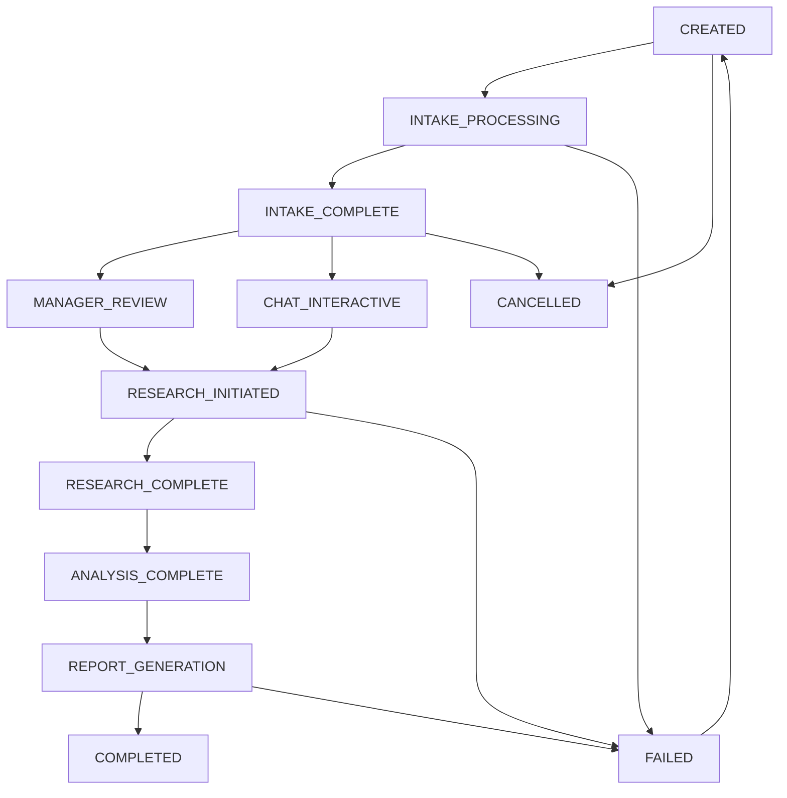

# 🎯 Legal Research Orchestrator

## Overview

The Legal Research Orchestrator is a sophisticated multi-agent coordination system designed specifically for WCAT (Workers' Compensation Appeal Tribunal) cases. It orchestrates multiple specialized agents to provide comprehensive legal analysis through a unified workflow.

## 🏗️ Architecture

### Core Components

#### 1. LegalOrchestratorAgent
The main coordinator that manages the entire legal research workflow:
- **Workflow Management**: Coordinates intake → analysis → research → cross-reference
- **Agent Coordination**: Manages communication between specialized agents
- **State Management**: Tracks workflow progress and maintains context
- **Chat Interface**: Optional interactive consultation during workflow
- **WCAT Specialization**: Focused on Workers' Compensation cases

#### 2. WorkflowManager
Handles workflow states and transitions:
- **State Tracking**: Manages workflow progression through defined states
- **Data Persistence**: Saves workflow state to disk for recovery
- **Audit Trail**: Maintains complete history of workflow transitions
- **Progress Monitoring**: Provides real-time workflow status

#### 3. AgentCoordinator
Manages agent communication and task delegation:
- **Agent Lifecycle**: Creates, manages, and stops agent instances
- **Concurrent Execution**: Manages parallel task execution
- **Load Balancing**: Distributes work across available agents
- **Error Handling**: Implements retry logic and failure recovery

## 🔄 Workflow States

The orchestrator manages workflows through these states:



## 🚀 Getting Started

### Basic Usage

```python
from ai_research_assistant.agent.orchestrator import LegalOrchestratorAgent, LegalWorkflowConfig

# Configure the orchestrator
config = LegalWorkflowConfig(
    enable_chat_interface=True,
    auto_proceed_after_intake=False,
    require_human_approval=True,
    max_concurrent_agents=3,
    timeout_seconds=1800
)

# Initialize orchestrator
orchestrator = LegalOrchestratorAgent(
    orchestrator_config=config,
    global_settings_manager=your_settings_manager
)

# Start a workflow
result = await orchestrator.run_task(
    task_type="start_legal_workflow",
    parameters={
        "client_info": {
            "name": "John Smith",
            "case_description": "Workers comp back injury case"
        },
        "case_type": "wcat_appeal",
        "documents": ["/path/to/medical_report.pdf", "/path/to/employer_response.pdf"],
        "research_queries": ["back injury compensation", "WCAT precedents"]
    }
)
```

### Web Interface Usage

1. **Access the Orchestrator Tab**: Navigate to "🎯 Legal Orchestrator" in the web interface
2. **Configure Settings**: Set chat interface, auto-proceed, and concurrency options
3. **Start Workflow**: Enter client info, upload documents, and specify research queries
4. **Monitor Progress**: Use the monitoring panel to track workflow progress
5. **Interactive Chat**: Use the chat interface for case consultation
6. **Review Results**: Access comprehensive reports and export results

## 🎯 Supported Task Types

### Primary Workflow Tasks

#### `start_legal_workflow`
Initiates a new legal research workflow
```python
parameters = {
    "client_info": {"name": "Client Name", "case_description": "..."},
    "case_type": "wcat_appeal",
    "documents": ["file1.pdf", "file2.docx"],
    "research_queries": ["query1", "query2"]
}
```

#### `process_intake_documents`
Processes documents through the intake agent
```python
parameters = {
    "documents": ["file1.pdf", "file2.png"],
    "enable_source_tracking": True,
    "enable_insurance_detection": True
}
```

#### `coordinate_research`
Coordinates research across multiple agents
```python
parameters = {
    "research_scope": "comprehensive",
    "include_precedents": True,
    "cross_reference": True
}
```

#### `interactive_chat`
Handles interactive chat consultation
```python
parameters = {
    "message": "What are the key precedents for my case?"
}
```

#### `generate_final_report`
Generates comprehensive case analysis report
```python
parameters = {
    "include_recommendations": True,
    "export_format": "comprehensive"
}
```

#### `get_workflow_status`
Retrieves current workflow status
```python
parameters = {
    "workflow_id": "uuid-here"  # Optional, uses active workflow if not provided
}
```

## ⚙️ Configuration

### LegalWorkflowConfig Options

```python
LegalWorkflowConfig(
    # Workflow settings
    enable_chat_interface=True,          # Enable interactive chat
    auto_proceed_after_intake=False,     # Auto-start research after intake
    require_human_approval=True,         # Require approval for transitions

    # Agent coordination
    max_concurrent_agents=3,             # Max parallel agents
    timeout_seconds=1800,                # Task timeout (30 minutes)
    retry_failed_tasks=True,             # Retry failed operations

    # WCAT specialization
    wcat_database_path=None,             # Custom database path
    document_source_tracking=True,       # Track document sources
    insurance_company_detection=True,    # Detect insurance companies

    # Output settings
    generate_comprehensive_report=True,   # Generate detailed reports
    maintain_audit_trail=True            # Keep complete audit trail
)
```

## 🎭 Agent Coordination

The orchestrator coordinates these specialized agents:

### 1. Intake Agent
- **Purpose**: Process and analyze documents with OCR
- **Tasks**: Document processing, source tracking, insurance detection
- **Output**: Structured document analysis and metadata

### 2. Legal Research Agent
- **Purpose**: Find similar WCAT cases and precedents
- **Tasks**: Case search, legal analysis, precedent identification
- **Output**: Similar cases, legal arguments, precedent analysis

### 3. Cross Reference Agent
- **Purpose**: Cross-reference findings with existing database
- **Tasks**: Relationship analysis, pattern identification, correlation
- **Output**: Cross-reference results, relationship maps

### 4. Database Maintenance Agent
- **Purpose**: Update database with new findings
- **Tasks**: Database updates, data consistency, optimization
- **Output**: Database status, update confirmations

## 📊 Workflow Monitoring

### Real-time Status
```python
# Get current workflow status
status = await orchestrator.run_task(
    task_type="get_workflow_status",
    parameters={"workflow_id": workflow_id}
)

print(f"Current state: {status['state']}")
print(f"Progress: {status['progress_percentage']}%")
```

### Progress Tracking
- **State Transitions**: Track progression through workflow states
- **Agent Status**: Monitor individual agent performance
- **Task Completion**: View completed and pending tasks
- **Error Tracking**: Monitor failures and retry attempts

## 🔍 Error Handling

### Automatic Recovery
- **Task Retries**: Failed tasks are automatically retried
- **Agent Recovery**: Failed agents are restarted
- **State Recovery**: Workflow state is preserved and recoverable
- **Graceful Degradation**: System continues with reduced functionality

### Error Types
- **Timeout Errors**: Tasks exceeding time limits
- **Agent Failures**: Individual agent crashes or errors
- **Workflow Failures**: Critical workflow state issues
- **Resource Errors**: Memory, disk, or network issues

## 🎨 Customization

### Custom Agent Integration
```python
# Register custom agent type
coordinator.register_agent_type("custom_agent", CustomAgentClass)

# Use in workflow
task_specs = [
    {
        "agent_type": "custom_agent",
        "task_type": "custom_task",
        "parameters": {"custom_param": "value"}
    }
]
```

### Custom Workflow States
```python
# Add custom states to WorkflowManager
workflow_manager.add_custom_state("CUSTOM_PROCESSING")
workflow_manager.add_transition("INTAKE_COMPLETE", "CUSTOM_PROCESSING")
```

## 🚦 Best Practices

### 1. Workflow Design
- Start with intake processing for all new cases
- Use chat interface for complex case consultation
- Monitor progress regularly during long workflows
- Save workflow state frequently for recovery

### 2. Agent Configuration
- Set appropriate timeout values for complex tasks
- Limit concurrent agents based on system resources
- Use retry logic for transient failures
- Monitor agent performance and resource usage

### 3. Document Management
- Organize documents by source (insurance, medical, user)
- Use OCR for scanned documents
- Track document relationships and dependencies
- Maintain document version control

### 4. Case Analysis
- Leverage WCAT-specific knowledge base
- Cross-reference with historical cases
- Generate comprehensive reports for review
- Maintain audit trail for legal compliance

## 🔧 Development

### Testing
```bash
# Run orchestrator tests
python -m pytest tests/orchestrator/

# Test specific components
python -m pytest tests/orchestrator/test_workflow_manager.py
python -m pytest tests/orchestrator/test_agent_coordinator.py
```

### Debugging
```python
# Enable debug logging
import logging
logging.getLogger("ai_research_assistant.agent.orchestrator").setLevel(logging.DEBUG)

# Monitor workflow state
workflow_state = await workflow_manager.get_workflow_state(workflow_id)
print(json.dumps(workflow_state, indent=2))
```

## 📈 Performance Optimization

### Resource Management
- Monitor memory usage during concurrent agent execution
- Use appropriate timeout values for different task types
- Implement connection pooling for database operations
- Cache frequently accessed data

### Scalability
- Horizontal scaling through multiple orchestrator instances
- Load balancing across agent instances
- Database sharding for large case volumes
- Asynchronous task processing for non-blocking operations

## 🤝 Integration

### WebUI Integration
The orchestrator integrates seamlessly with the web interface:
- **Primary Tab**: "🎯 Legal Orchestrator" for complete workflow management
- **Real-time Updates**: Live status and progress monitoring
- **Interactive Chat**: Built-in consultation interface
- **Results Export**: Multiple export formats for reports

### API Integration
```python
# REST API endpoints (if implemented)
POST /api/orchestrator/workflow/start
GET /api/orchestrator/workflow/{id}/status
POST /api/orchestrator/workflow/{id}/chat
GET /api/orchestrator/workflow/{id}/results
```

## 📚 Examples

### Complete Case Processing
```python
# 1. Start workflow
workflow_result = await orchestrator.run_task(
    task_type="start_legal_workflow",
    parameters={
        "client_info": {"name": "Jane Doe", "case_description": "Workplace injury"},
        "case_type": "wcat_appeal",
        "documents": ["medical_report.pdf", "incident_report.pdf"],
        "research_queries": ["workplace injury", "WCAT appeal process"]
    }
)

workflow_id = workflow_result["workflow_id"]

# 2. Process documents
await orchestrator.run_task(
    task_type="process_intake_documents",
    parameters={"documents": ["additional_evidence.pdf"]}
)

# 3. Interactive consultation
chat_result = await orchestrator.run_task(
    task_type="interactive_chat",
    parameters={"message": "What are the strengths of my case?"}
)

# 4. Coordinate research
research_result = await orchestrator.run_task(
    task_type="coordinate_research",
    parameters={}
)

# 5. Generate final report
report_result = await orchestrator.run_task(
    task_type="generate_final_report",
    parameters={}
)

print(f"Case analysis complete. Report saved to: {report_result['report_path']}")
```

This orchestrator system represents a significant advancement in legal case management, providing a unified, intelligent workflow for comprehensive WCAT case analysis and research.